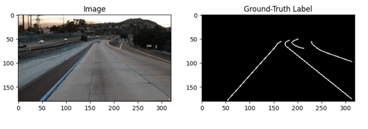
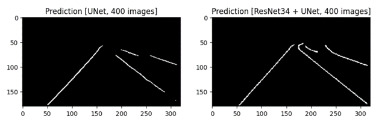
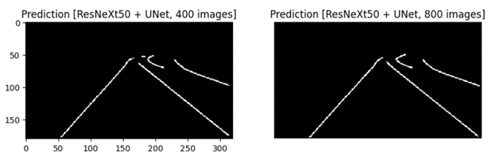

# CV-LaneDetection-DeepLearning

## Goal: 
This project is a semantic segmentation project for detecting lanes. The dataset used in this project is [TuSimple dataset](https://github.com/TuSimple/tusimple-benchmark/issues/3) which consists of more than 3000 images of highways from the car’s front viewpoint. The dataset is a benchmark in the field of lane detection. 

## Methods: 
This projects studies wo approaches for lane detection:
1. A simple [UNet network](https://lmb.informatik.uni-freiburg.de/people/ronneber/u-net/) which has a simple encoder-decoder design was used to extract segmentation masks for the lanes. 
2. A transfer learning method. The effect of using two pretrained networks ResNet34 and ResNeXt50 as the UNet’s encoder was measured. These two networks have been trained on the ImageNet dataset. 

## Results: 
While simple UNet were achieving meanIoU of 0.70, UNet with pretrained encoder of ResNeXt50 got the meanIoU of 0.79.

## Conclusions:
The meanIoU improves significantly using transfer learning method. Moreover, in terms of computation complexity, transfer learning can accelerate the training procedure. The results demonstrate that this structure could be used as an efficient lane detector unit for further uses in autonomous vehicles.

## Demonstrations:

